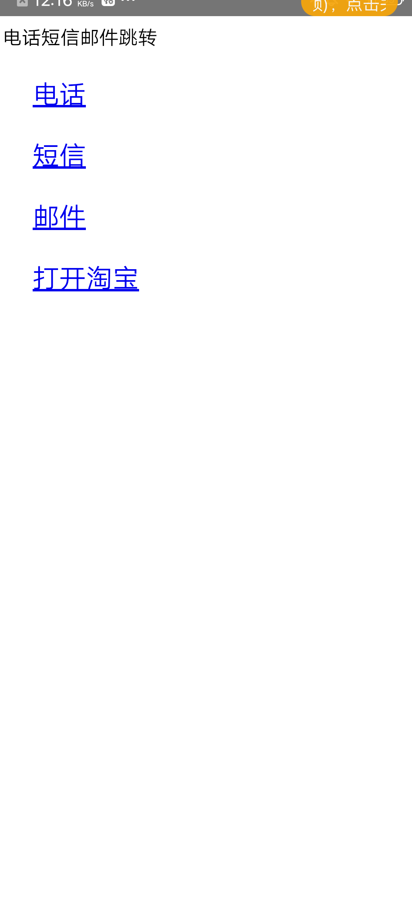
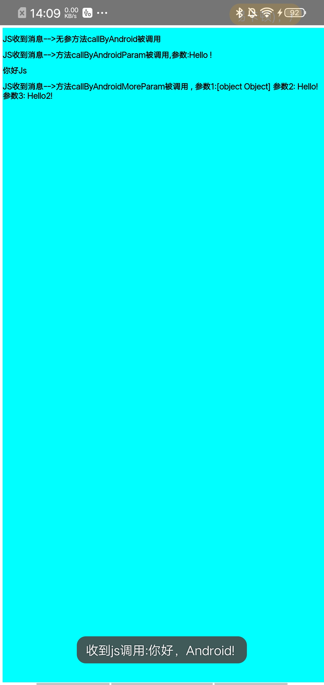
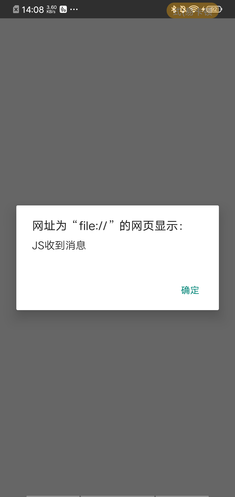
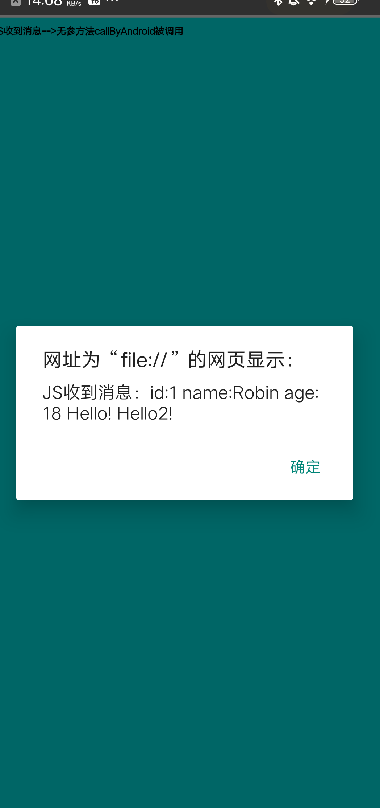
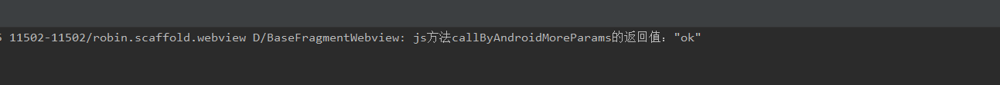

# Android-Simple-Webview
Android 功能强大的webview

1.scheme白名单机制
2.腾讯sonic
3.权限管理
4.Native和JS
5.文件上传与下载


## 打开一个普通网页：
```
Intent intent = new Intent(this, MyBrowserActivity.class);
intent.setData(Uri.parse("https://www.github.com"));
startActivity(intent);
```


## 打开自定义title的网页：
```
Intent intent = new Intent(this, MyBrowserActivity.class);
intent.putExtra("title", "这是我的title");
intent.setData(Uri.parse("https://www.github.com"));
startActivity(intent);
```

## 自带sonic功能，可打开此页面测试：
```
Intent intent = new Intent(this, MyBrowserActivity.class);
intent.putExtra("title", title);
intent.setData(Uri.parse("https://mc.vip.qq.com/demo/indexv3"));
startActivity(intent);
```
## 自定义scheme：
sms,tel,mailto,geo等功能已集成，如果想加自定义scheme，可参考sample中列子：
```
public class MyFragmentWebview extends BaseFragmentWebview {
	 @Override
    protected void init() {
        super.init();
        getController().registerToSchemeWhiteList("taobao");
    }
}

```
效果如下  



## 和JS的交互：
```
public class MyFragmentWebview extends BaseFragmentWebview {
	 @Override
    public void onAddJavaObjects() {
        super.onAddJavaObjects();
        webView.addJavascriptInterface(new JsInterfaceCompat(this), "MyName");
    }

     @Override
    public void uiOnPageFinish() {
        getController().getJsCall().callJs("callByAndroid");
        getController().getJsCall().callJs("callByAndroidParam","Hello !");
        getController().getJsCall().callJs("callByAndroidInteraction","你好Js");
        getController().getJsCall().callJs("callByAndroidMoreParams", new ValueCallback<String>() {
            @Override
            public void onReceiveValue(String value) {
                Log.d("BaseFragmentWebview", "js方法callByAndroidMoreParams的返回值："+ value);
            }
        }, getJson(), " Hello!", " Hello2!");
    }
}
```
相关的js代码：
```
  function sendHelloToAndroid() {
      // body...
      //console.log("call android")
      if(window.MyName!=null&&typeof(window.MyName)!="undefined"){
        window.MyName.callAndroid("你好，Android! ");
      }else{
         alert(typeof(window.MyName));
      }
     
  }

  function callByAndroid(){
      console.log("callByAndroid")
      alert("JS收到消息");
      showElement("JS收到消息-->无参方法callByAndroid被调用");
  }

  function callByAndroidParam(msg1){
     console.log("callByAndroid_param")
    alert("JS收到消息："+msg1);
    showElement("JS收到消息-->方法callByAndroidParam被调用,参数:"+msg1);

  }
  function callByAndroidMoreParams(objs,msg2,msg3){
     
     alert("JS收到消息："+"id:"+objs.id.toString()+" name:"+objs.name+" age:"+objs.age.toString()+msg2+msg3);
    showElement("JS收到消息-->方法callByAndroidMoreParam被调用 , 参数1:"+objs+"  参数2:"+msg2+"  参数3:"+msg3);
     return "ok";
  }

  function callByAndroidInteraction(msg){

    showElement(msg)

    window.setTimeout(sendHelloToAndroid,1000);

  }


  function showElement(msg){
      var div   =document.getElementById("div_box");  //获取div
      var ele=document.createElement('h2');    //创建h2元素节点
      ele.innerHTML=msg;                //设置h2节点的内容
      div.appendChild(ele);                    //添加子节点ele
  }
```

onAddJavaObjects中注册JS的句柄, 作用是js发消息给native：  



getController().getJsCall().callJs() 方法来执行js语句，以上js方法运行后：  




并且接受js函数返回值：  

