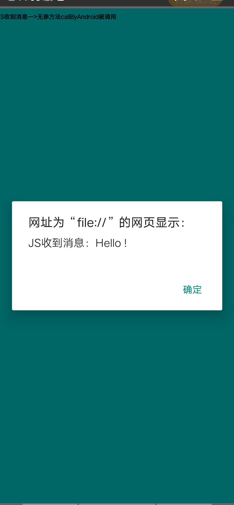

# Android-Simple-Webview
Android 功能强大的webview


## 一，打开一个普通网页：
```
Intent intent = new Intent(this, MyBrowserActivity.class);
intent.setData(Uri.parse("https://www.github.com"));
startActivity(intent);
```


## 二，打开自定义title的网页：
```
Intent intent = new Intent(this, MyBrowserActivity.class);
intent.putExtra("title", "这是我的title");
intent.setData(Uri.parse("https://www.github.com"));
startActivity(intent);
```

## 三，自带sonic功能，可打开此页面测试：
```
Intent intent = new Intent(this, MyBrowserActivity.class);
intent.putExtra("title", title);
intent.setData(Uri.parse("https://mc.vip.qq.com/demo/indexv3"));
startActivity(intent);
```
## 四，自定义scheme：
sms,tel,mailto,geo等功能已集成，如果想加自定义scheme，可参考sample中列子：
```
public class MyFragmentWebview extends BaseFragmentWebview {
	 @Override
    protected void init() {
        super.init();
        getController().registerToSchemeWhiteList("taobao");
    }
}

```
效果如下  


## 五，和JS的交互：
```
public class MyFragmentWebview extends BaseFragmentWebview {
	 @Override
    public void onAddJavaObjects() {
        super.onAddJavaObjects();
        webView.addJavascriptInterface(new JsInterfaceCompat(this), "MyName");
    }

     @Override
    public void uiOnPageFinish() {
        getController().getJsCall().callJs("callByAndroid");
        getController().getJsCall().callJs("callByAndroidParam","Hello !");
        getController().getJsCall().callJs("callByAndroidInteraction","你好Js");
        getController().getJsCall().callJs("callByAndroidMoreParams", new ValueCallback<String>() {
            @Override
            public void onReceiveValue(String value) {
                Log.d("BaseFragmentWebview", "js方法callByAndroidMoreParams的返回值："+ value);
            }
        }, getJson(), " Hello!", " Hello2!");
    }
}
```
相关的js代码：
```
  function sendHelloToAndroid() {
      // body...
      //console.log("call android")
      if(window.MyName!=null&&typeof(window.MyName)!="undefined"){
        window.MyName.callAndroid("你好，Android! ");
      }else{
         alert(typeof(window.MyName));
      }
     
  }

  function callByAndroid(){
      console.log("callByAndroid")
      alert("JS收到消息");
      showElement("JS收到消息-->无参方法callByAndroid被调用");
  }

  function callByAndroidParam(msg1){
     console.log("callByAndroid_param")
    alert("JS收到消息："+msg1);
    showElement("JS收到消息-->方法callByAndroidParam被调用,参数:"+msg1);

  }
  function callByAndroidMoreParams(objs,msg2,msg3){
     
     alert("JS收到消息："+"id:"+objs.id.toString()+" name:"+objs.name+" age:"+objs.age.toString()+msg2+msg3);
    showElement("JS收到消息-->方法callByAndroidMoreParam被调用 , 参数1:"+objs+"  参数2:"+msg2+"  参数3:"+msg3);
     return "ok";
  }

  function callByAndroidInteraction(msg){

    showElement(msg)

    window.setTimeout(sendHelloToAndroid,1000);

  }


  function showElement(msg){
      var div   =document.getElementById("div_box");  //获取div
      var ele=document.createElement('h2');    //创建h2元素节点
      ele.innerHTML=msg;                //设置h2节点的内容
      div.appendChild(ele);                    //添加子节点ele
  }
```

onAddJavaObjects中注册JS的句柄, 作用是js发消息给native：  


getController().getJsCall().callJs() 方法来执行js语句，以上js方法运行后：  




并且接受js函数返回值：  


## 六，权限自动管理：
将webview申请的权限转换为native申请权限：
测试一个需要位置授权的页面：
```
Intent intent = new Intent(this, MyBrowserActivity.class);
intent.setData(Uri.parse("https://m.baidu.com"));
startActivity(intent);
```
webview会弹出授权框：  


## 七，文件自动下载
支持webview中的文件下载，监听，断点续传，下载完成则自动打开对应文件  
设置监听
```
public class MyFragmentWebview extends BaseFragmentWebview {
    @Override
    protected void init() {
        super.init();

        setDownloadProgressListener(new DownloadProgressListener() {
            @Override
            public void onProgress(long progress, long total, boolean done, DownLoadTaskData downLoadTaskData) {
                long initSize = downLoadTaskData.getInitalSize();
                long currentSize = initSize + progress;
                long totalSize = total + initSize;
                Log.e("WebController", "currentSize=" + currentSize + "||totalSize=" + totalSize);
            }

            @Override
            public void onDownloadFinish(DownLoadTaskData downLoadTaskData) {
                Log.e("WebController", "onDownloadFinish");
            }

            @Override
            public void onDownloadPause() {
            }

            @Override
            public void onDownloadStart() {
            }

            @Override
            public void onDownloadCancel() {
                Log.e("WebController", "onDownloadCancel");
            }

            @Override
            public void onDownloadError(String filePath, String url, String message) {
                Log.e("WebController", "onDownloadError:filePath=" + filePath + "||url=" + url + "||message=" + message);
            }
        });
    }
}
```
同时需要设置好provider：
```
<provider
    android:name="androidx.core.content.FileProvider"
    android:authorities="${applicationId}.fileprovider"
    android:exported="false"
    android:grantUriPermissions="true">
    <meta-data
        android:name="android.support.FILE_PROVIDER_PATHS"
        android:resource="@xml/file_provider_paths" />
</provider>
```
file_provider_paths的内容：  
```
<paths xmlns:android="http://schemas.android.com/apk/res/android">
    <external-path
        name="robin_file"
        path="." />
</paths>
```

## 八，自定义Developer模块
如果在webview各个生命周期需要完成业务，则可以注册自定义的Develope模块，模块支持优先级
注册模块：
```
public class MyFragmentWebview extends BaseFragmentWebview {
	@Override
    public void onDevelopmentRegister() {
        getController().registerDevelopment(new FirstWebDevelopment(0));
        getController().registerDevelopment(new SecondWebDevelopment(1));
    }
}
```
具体模块代码：
```
public class FirstWebDevelopment extends BaseWebDevelopment {
    public FirstWebDevelopment(int priority) {
        super(priority);
    }

    @Override
    public boolean onPageStarted(WebView view, CommUrl url, Bitmap favicon) {
        Log.e("BaseWebDevelopment", "first develop onPageStarted");
        return false;
    }

        @Override
    public boolean onPageFinished(WebView view, CommUrl url) {
        Log.e("BaseWebDevelopment", "first develop onPageFinished");
        return true;
    }
}

public class SecondWebDevelopment extends BaseWebDevelopment {
    public SecondWebDevelopment(int priority) {
        super(priority);
    }

    @Override
    public boolean onPageStarted(WebView view, CommUrl url, Bitmap favicon) {
        Log.e("BaseWebDevelopment", "second develop onPageStarted");
        return false;
    }

        @Override
    public boolean onPageFinished(WebView view, CommUrl url) {
        Log.e("BaseWebDevelopment", "second develop onPageFinished");
        return false;
    }
}
```
使用迭代器方式，如果优先级高的模块return true，代表此生命周期方法已被消耗，则不再往下透传
上述"second develop onPageFinished"将不会被执行到：
